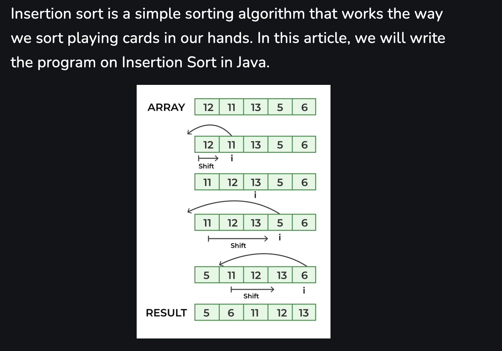

# Insertion sort

### Time Complexity

- **Best Case** : O(n) - Occurs when the array is already sorted. Only one comparison is made per element.
- **Average and Worst Case** : O(n^2) - Occurs when the array is in reverse order, requiring maximum shifts and comparisons for each element.
### Space Complexity : 
- **Auxiliary Space** : O(1) - Insertion sort is an in-place sorting algorithm, meaning it requires only a constant amount of additional memory space.