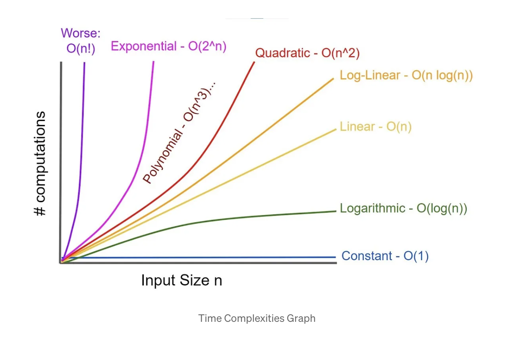

# Big O Time Complexity
Big O notation is used to describe the performance or complexity of an algorithm, specifically how it scales relative to the input size. It focuses on the worst-case scenario, providing a measure of how the algorithm's execution time or space requirements grow as the input grows.


## Big O complexities
### O(1) - Constant Time
- An operation that always takes the same time, regardless of the input size
- Accessing an element by index in an array takes constant time since it doesn’t depend on the size of the array.
```java
public class ConstantTimeExample {
    public static void main(String[] args) {
        int[] array = {1, 2, 3, 4, 5};
        System.out.println(array[2]); // O(1) operation
    }
}
```

### O(log n) - Logarithmic
- An algorithm that reduces the size of the problem by a constant factor each time (e.g., binary search).
- Binary search splits the array in half at each step, making it a logarithmic time complexity O(log n).
```java
import java.util.Arrays;

public class LogarithmicTimeExample {
    public static int binarySearch(int[] array, int target) {
        int left = 0;
        int right = array.length - 1;
        while (left <= right) {
            int middle = left + (right - left) / 2;
            if (array[middle] == target) {
                return middle;
            }
            if (array[middle] < target) {
                left = middle + 1;
            } else {
                right = middle - 1;
            }
        }
        return -1;
    }

    public static void main(String[] args) {
        int[] sortedArray = {1, 3, 5, 7, 9};
        System.out.println(binarySearch(sortedArray, 7)); // O(log n) operation
    }
}
```

### O(n log n) - Linearithmic Time
- An algorithm that performs a linear operation followed by a logarithmic one. This is common in efficient sorting algorithms like merge sort or quicksort.
- Merge sort splits the array (log n times) and merges them back in linear time (n), resulting in O(n log n) complexity.

### O(n) - Linear/Proportional
- An operation where the time grows directly in proportion to the input size.
  In this case, you are iterating through the entire array, and the number of operations grows linearly with the size of the array.
```java
public class LinearTimeExample {
    public static void main(String[] args) {
        int[] array = {1, 2, 3, 4, 5};
        for (int i : array) {
            System.out.println(i); // O(n) operation
        }
    }
}
```
### O(n²) - Quadratic Time
- An algorithm that requires time proportional to the square of the input size. This commonly occurs with nested loops.
- The **bubbleSort** algorithm has two nested loops, resulting in an O(n²) time complexity
```java
public class QuadraticTimeExample {
    public static void bubbleSort(int[] array) {
        int n = array.length;
        for (int i = 0; i < n - 1; i++) { // O(n)
            for (int j = 0; j < n - i - 1; j++) { // O(n)
                if (array[j] > array[j + 1]) {
                    // Swap elements
                    int temp = array[j];
                    array[j] = array[j + 1];
                    array[j + 1] = temp;
                }
            }
        }
    }
}
```
### O(2ⁿ) - Exponential Time
- An algorithm whose runtime doubles with each additional input, often seen in problems like recursive algorithms without memoization.
- Each recursive call splits into two additional calls, leading to exponential growth in the number of operations.
```java
public class ExponentialTimeExample {
    public static int fibonacci(int n) {
        if (n <= 1) {
            return n;
        }
        return fibonacci(n - 1) + fibonacci(n - 2); // O(2^n) operation
    }

    public static void main(String[] args) {
        System.out.println(fibonacci(5)); // Exponential time for larger inputs
    }
}
```
### O(n!) - Factorial Time
- This is the worst-case time complexity, where the algorithm performs operations proportional to the factorial of the input size.
- 


### Conclusion:
* **O(1)**: Constant time (best case)
* **O(log n)**: Logarithmic time (binary search)
* **O(n log n)**: Linearithmic time (merge sort)
* **O(n)**: Linear time (looping through elements)
* **O(n²)**: Quadratic time (nested loops, bubble sort)
* **O(2ⁿ)**: Exponential time (recursive algorithms like Fibonacci)
* **O(n!)**: Factorial time (brute force solutions like permutations)

`Choosing the right algorithm with optimal Big O complexity is crucial for performance, especially when dealing with large datasets`
